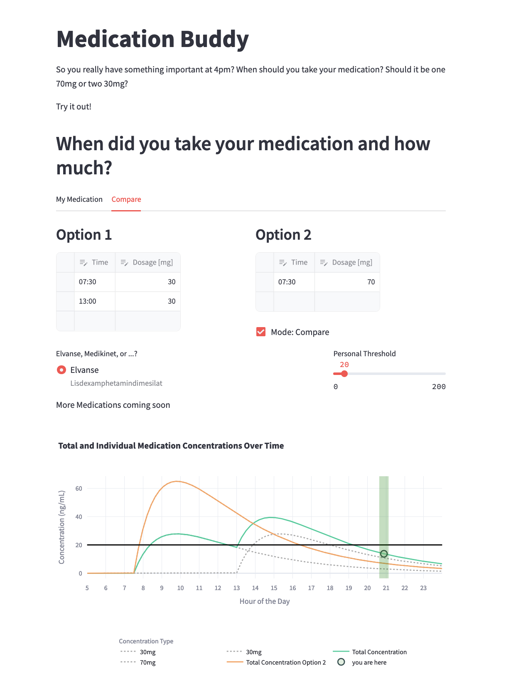

# Medication Concentration Calculator using a fitted bi-exponential model.

1. I used a paper to fit a general bi-exponential model to research data. [See this notebook.](./data_and_fit/fit_elvanse_concentration.ipynb)
2. I created a streamlit app to Enter individual intake and visualize different Options.




# Install and Run
```
pip install -r requirements
```
```
streamlit run streamlit_app.py --server.enableCORS false --server.enableXsrfProtection false
```
